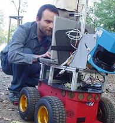
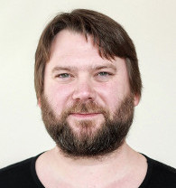
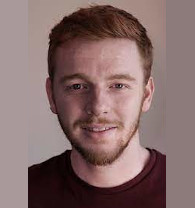
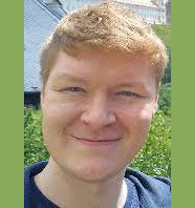
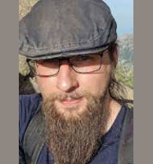
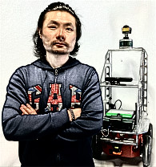
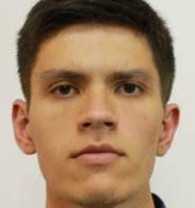

##  Life-Long Learning of environmental dynamics for socially-aware navigation of Autonomous Robots

* [About](#about)
* [Partners](#partners)
* [Publications](#publications)
* [Results](#results)

## News

\[20 Apr 2023\]: Dr. Zhi Yan gave a talk at [CTU](https://cs.fel.cvut.cz/en/news/detail/1719)!

\[19 Apr 2023\]: The UTBM team started to visit the CTU team!

\[14 Apr 2023\]: The project homepage is online!

\[28 Mar 2023\]: The CTU team started to visit the UTBM team!

\[21 Feb 2023\]: The project is kicked off!

## About

3L4AR is a researcher mobility project between the [Chronorobotics Lab](https://chronorobotics.tk/en) at the [Czech Technical University in Prague (CTU)](https://www.cvut.cz/en) in Czechia and the [CIAD Lab](http://www.ciad-lab.fr/) at the [University of Technology of Belfort-Montbéliard (UTBM)](https://www.utbm.fr/) in France. The project aims to improve acceptance of mobile robots through the integration of lifelong learning methods into the modules that constitute the core of their navigation systems. We argue that the robustness of the navigation systems in dynamic environments and changing conditions can be improved during the robot routine operation through machine learning methods. The incorporation of lifelong learning would allow the robots to gradually improve their ability to perceive, understand and exploit the environmental dynamics caused by natural processes and human activities. Understanding of the environment dynamics will allow the robots to anticipate and to react more intelligently to the everyday situations, which will improve their acceptance by humans.

## Partners

###  Chronorobotics Lab, CTU

|  |  |  |  |  |
| :-: | :-: | :-: | :-: | :-: |
| [Tomas Krajnik](http://labe.felk.cvut.cz/~tkrajnik/) (PI) Associate Professor | [Tomas Vintr](https://scholar.google.com/citations?user=SrvBgHwAAAAJ) Ph.D. Student | [George Broughton](https://scholar.google.com/citations?user=x-wVOCkAAAAJ) Ph.D. Student | [Tomas Roucek](https://scholar.google.com/citations?user=7L9HeNkAAAAJ) Ph.D. Student | [Zdenek Rozsypalek](https://scholar.google.com/citations?user=7--1EBwAAAAJ) Ph.D. Student |

|  |  |
| :-: | :-: |
| [Jiri Ulrich](https://scholar.google.com/citations?user=vMtZ5FcAAAAJ) Ph.D. Student | [Jan Blaha](https://scholar.google.com/citations?user=Y0bBRjcAAAAJ) Ph.D. Student |

###  CIAD Lab, UTBM

|  |  |  |
| :-: | :-: | :-: |
| [Zhi Yan](https://yzrobot.github.io/) (PI) Assistant Professor | [Rui Yang](https://scholar.google.com/citations?user=j-kP4lkAAAAJ)  Ph.D. Student | [Iaroslav Okunevich](https://scholar.google.com/citations?user=UBmFfS4AAAAJ)  Ph.D. Student |

## Publications

## Results

---
[CZ MSMT project](http://www.msmt.cz/vyzkum-a-vyvoj-2/mobility-6) (No. 8J23FR023), [PHC Barrande project](https://www.campusfrance.org/fr/barrande) (No. 49275QM), 2023-2024 (2 years).

   
---
