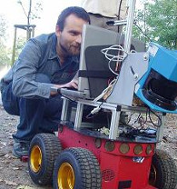
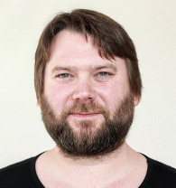
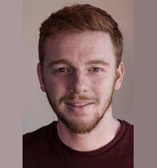
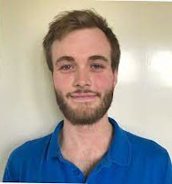
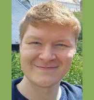
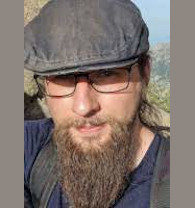
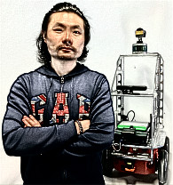
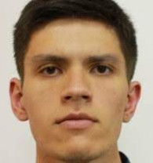

##  Life-Long Learning of environmental dynamics for socially-aware navigation of Autonomous Robots

* [About](#about)
* [Partners](#partners)
* [Publications](#publications)
* [Results](#results)

## News

\[2 Dec 2024\]: The CTU team started to visit the UTBM team!

\[22 Nov 2024\]: The CTU team started to visit the UTBM team!

\[10 Nov 2024\]: The UTBM team started to visit the CTU team!

\[13 Apr 2024\]: The UTBM team started to visit the CTU team!

\[13 Dec 2023\]: Dr. Tomas Krajnik participated in Mr. Rui Yang’s Ph.D. defense as his opponent!

\[10 Dec 2023\]: The CTU team started to visit the UTBM team!

\[13 Nov 2023\]: The UTBM team visited the TESLA factory in Prague!

\[9 Nov 2023\]: The UTBM team started to visit the CTU team!

\[20 Apr 2023\]: Dr. Zhi Yan gave a talk at [CTU](https://cs.fel.cvut.cz/en/news/detail/1719)!

\[19 Apr 2023\]: The UTBM team started to visit the CTU team!

\[14 Apr 2023\]: The project homepage is online!

\[28 Mar 2023\]: The CTU team started to visit the UTBM team!

\[21 Feb 2023\]: The project is kicked off!

## About

3L4AR is a researcher mobility project between the [Chronorobotics Lab](https://chronorobotics.tk/en) at the [Czech Technical University in Prague (CTU)](https://www.cvut.cz/en) in Czechia and the [CIAD Lab](http://www.ciad-lab.fr/) at the [University of Technology of Belfort-Montbéliard (UTBM)](https://www.utbm.fr/) in France. The project aims to improve acceptance of mobile robots through the integration of lifelong learning methods into the modules that constitute the core of their navigation systems. We argue that the robustness of the navigation systems in dynamic environments and changing conditions can be improved during the robot routine operation through machine learning methods. The incorporation of lifelong learning would allow the robots to gradually improve their ability to perceive, understand and exploit the environmental dynamics caused by natural processes and human activities. Understanding of the environment dynamics will allow the robots to anticipate and to react more intelligently to the everyday situations, which will improve their acceptance by humans.

## Partners

###  Chronorobotics Lab, CTU

|  |  |  |  |  |
| :-: | :-: | :-: | :-: | :-: |
| [Tomas Krajnik](http://labe.felk.cvut.cz/~tkrajnik/) (PI) Associate Professor | [Tomas Vintr](https://scholar.google.com/citations?user=SrvBgHwAAAAJ) Ph.D. Student | [George Broughton](https://scholar.google.com/citations?user=x-wVOCkAAAAJ) Ph.D. Student | [Tomas Roucek](https://scholar.google.com/citations?user=7L9HeNkAAAAJ) Ph.D. Student | [Zdenek Rozsypalek](https://scholar.google.com/citations?user=7--1EBwAAAAJ) Ph.D. Student |

|  |  |
| :-: | :-: |
| [Jiri Ulrich](https://scholar.google.com/citations?user=vMtZ5FcAAAAJ) Ph.D. Student | [Jan Blaha](https://scholar.google.com/citations?user=Y0bBRjcAAAAJ) Ph.D. Student |

###  CIAD Lab, UTBM

|  |  |  |  |
| :-: | :-: | :-: | :-: |
| [Zhi Yan](https://yzrobot.github.io/) (PI) Assistant Professor | [Rui Yang](https://scholar.google.com/citations?user=j-kP4lkAAAAJ)  Ph.D. Student | [Iaroslav Okunevich](https://scholar.google.com/citations?user=UBmFfS4AAAAJ)  Ph.D. Student | [Johnata Brayan](https://scholar.google.com/citations?user=OxFeRc4AAAAJ)  Master's student |

## Publications

1. Iaroslav Okunevich, Alexandre Lombard, Tomas Krajnik, Yassine Ruichek, and Zhi Yan. [Online context learning for socially compliant navigation](https://arxiv.org/abs/2406.11495). *IEEE Robotics and Automation Letters (RA-L)*, March 2025.

2. Rui Yang, Tao Yang, Zhi Yan, Tomas Krajnik, and Yassine Ruichek. [Preventing catastrophic forgetting in continuous online learning for autonomous driving](https://hal.science/hal-04691842). In *Proceedings of the 2024 IEEE/RSJ International Conference on Intelligent Robots and Systems (IROS)*, Abu Dhabi ,UAE, October 2024.

3. Tao Yang, Jinwen Hu, You Li, Cheng Zhao, Li Sun, Tomas Krajnik, and Zhi Yan. [3D ToF LiDAR for mobile robotics in harsh environments: A review](https://www.worldscientific.com/doi/abs/10.1142/S230138502530001X). *Unmanned Systems*, April 2024.

4. Tomas Vintr, George Broughton, Tomas Roucek, Zhi Yan, and Tomas Krajnik. [Dataset collection for long-term forecasting of human presence, motion and activity](https://motionpredictionicra2023.github.io/proceedings/vintr2023LHMPws.pdf). *ICRA Workshop on Long-term Human Motion Prediction*, May 2023.

## Results

---
[CZ MSMT project](http://www.msmt.cz/vyzkum-a-vyvoj-2/mobility-6) (No. 8J23FR023), [PHC Barrande project](https://www.campusfrance.org/fr/barrande) (No. 49275QM), 2023-2024 (2 years).

   
---
